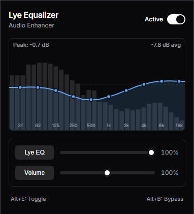

<div align="center">
  
  <h1>Lye Equalizer</h1>
  <p>A Manifest V3 browser EQ with a built-in limiter and auto-resonance suppression.</p>
</div>

<br />

I got tired of Chrome audio sounding thin and most EQ extensions either causing distortion or just using outdated Manifest V2 code. So I built Lye Equalizer. 

It runs entirely in the background using the Web Audio API (`chrome.offscreen` + `chrome.tabCapture`), meaning it doesn't inject heavy scripts into the tabs you're actually trying to use.

## Features

- **10-Band EQ:** Standard setup (31Hz to 16kHz) but uses proper LowShelf/HighShelf on the ends and Butterworth peaking filters (`Q=0.707`) in the middle to avoid phase smearing.
- **Brickwall Limiter:** There's a `DynamicsCompressorNode` at the end of the chain acting as a hard limiter (-0.5dBFS). You can boost frequencies without blowing out your speakers or getting digital clipping.
- **Auto-EQ (Dynamic Suppression):** It doesn't just slap a static Harman curve on everything. It analyzes the FFT bins in real-time and ducks harsh resonant peaks if they stick out too much.
- **Accurate Spectrum:** The visualizer uses a base-10 logarithmic scale (20Hz–20kHz) so the visual actually matches what your ears are hearing.
- **Loudness Normalization:** Tries to keep everything around a modern target so you aren't constantly adjusting your volume between quiet YouTube dialogue and loud music.
- **MV3 Ready:** Fully compliant with Chrome's Manifest V3 requirements.

## Tech Stack

- React 19 + TypeScript
- Vite + esbuild (builds down to ~64KB gzipped)
- Native Web Audio API 

## Running it locally

1. Clone it down:
   ```bash
   git clone https://github.com/LyeDevGit/smart-auto-equalizer.git
   cd smart-auto-equalizer
   ```

2. Install and build:
   ```bash
   npm install
   npm run build
   ```

3. Load it into Chrome:
   - Go to `chrome://extensions/`
   - Turn on **Developer mode**
   - Click **Load unpacked** and pick the `dist/` folder.

### Shortcuts
- `Alt + E` : Toggle EQ on/off for the current tab
- `Alt + B` : Bypass filters (good for A/B testing)

## Contributing

Pull requests are welcome. If you want to mess with the audio math, you'll want to look at `src/offscreen.ts`. The UI stuff is mostly in `src/popup/`.

## License

MIT
